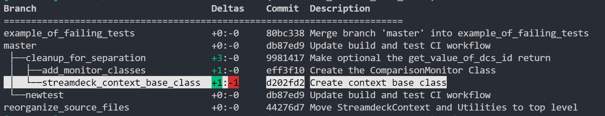

# git-branch-tree

Executing git-tree.py from within a git repository will query all git branches and print them to the terminal in a hierarchical tree format, according to their upstream branch mapping.

## Installation
Install the git-tree.py script (requires Python3 installed) and set it as a git alias to `git tree`:
```
curl -sL -o ~/.git-tree.py https://raw.githubusercontent.com/charlestytler/git-branch-tree/refs/heads/master/git-tree.py && chmod +x ~/.git-tree.py $$ git config --global alias.tree '!~/.git-tree.py'
```
or with git clone:
```
git clone https://github.com/charlestytler/git-branch-tree.git /tmp/git-branch-tree &&\
cp /tmp/git-branch-tree/git-tree.py ~/.git-tree.py &&\
git config --global alias.tree '!~/.git-tree.py'
```

## Usage
When in a git repository run the command `git tree`
This will show a tree of all branches installed.
Note that when creating branches you should be assigning their upstream branch, i.e. `git branch --set-upstream <parent_branch>` or `git branch -u <parent_branch>`.

## Example

### Default git branch terminal output
```
> git br -vv
  add_monitor_classes           eff3f10 [cleanup_for_separation: ahead 1] Create the ComparisonMonitor Class
  cleanup_for_separation        9981417 [master: ahead 3] Make optional the get_value_of_dcs_id return
  example_of_failing_tests      80bc338 [origin/example_of_failing_tests] Merge branch 'master' into example_of_failing_tests
  master                        db87ed9 [origin/master] Update build and test CI workflow
  newtest                       db87ed9 [master] Update build and test CI workflow
  reorganize_source_files       44276d7 [origin/reorganize_source_files] Move StreamdeckContext and Utilities to top level
* streamdeck_context_base_class d202fd2 [cleanup_for_separation: ahead 1, behind 1] Create context base class
```
  
### Script branch output
Executing `git-tree.py` shows:  



